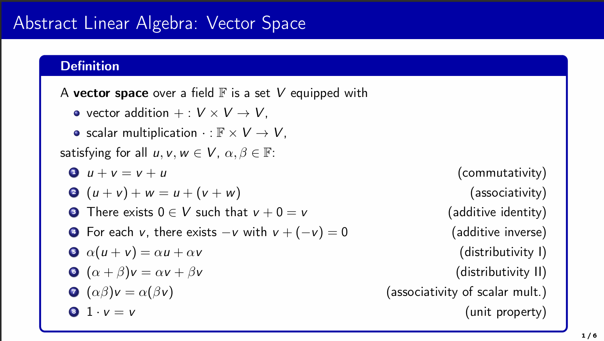
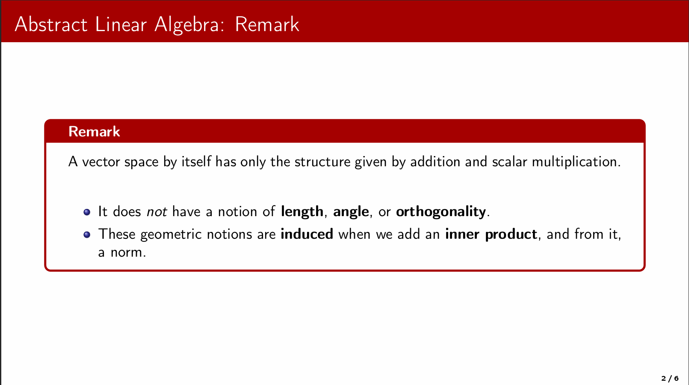
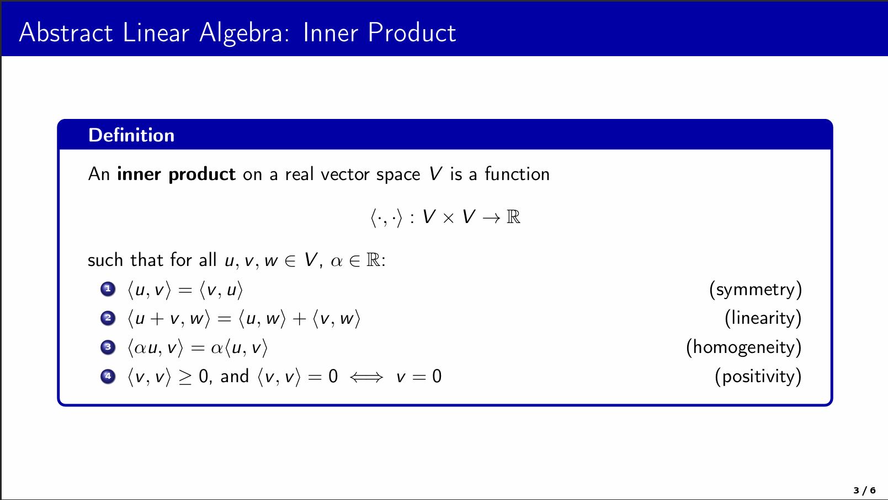
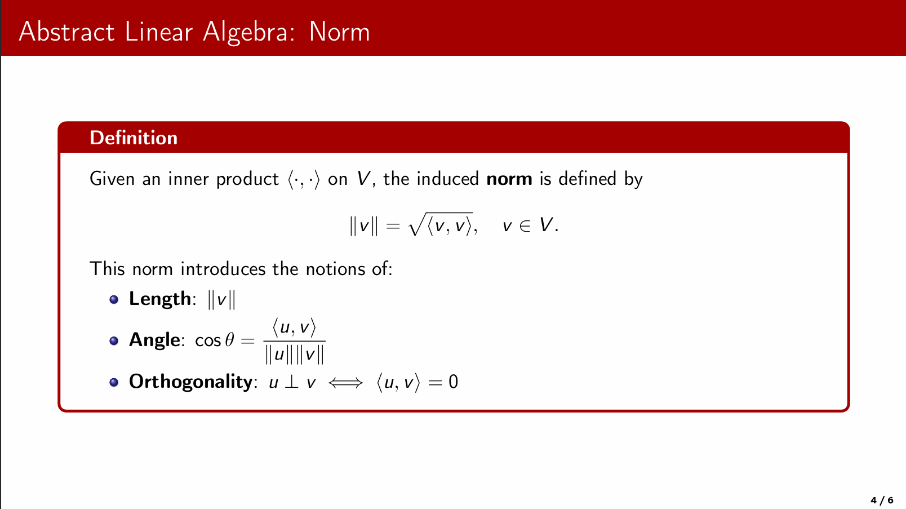
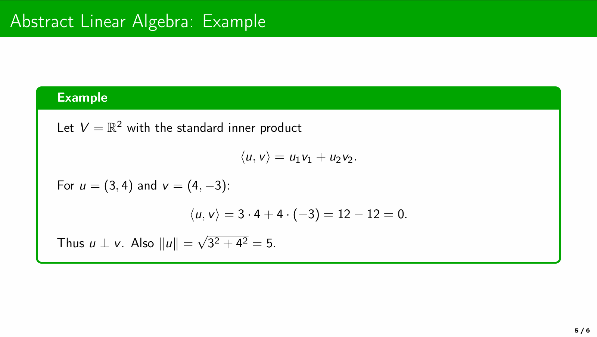
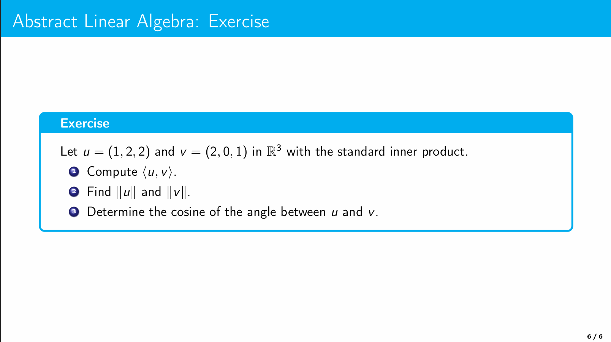

# Beamer $\LaTeX$ Teaching Template (Copenhagen-based)

This repository contains a $\LaTeX$  Beamer template designed for teaching mathematics and physics.  
It extends the standard *Copenhagen* theme with:

- ✅ **Custom color palette** (`myblue`, `myred`, `mygreen`, `mycyan`)  
- ✅ **Header macros** (`\blueheader`, `\redheader`, `\greenheader`, `\cyanheader`)  
- ✅ **tcolorbox environments** for definitions, theorems, tasks, and examples  
- ✅ **Clean layout** with frame numbers and no navigation symbols  

---

## 🎨 Features

- **Custom headers**  
  Easily set a consistent color band for each frame:
  ```latex
  \blueheader
  \begin{frame}
  \frametitle{Example}
  Content here...
  \end{frame}
  ```

* **Theorem-like boxes**
  Defined with `tcolorbox`, e.g.:

  ```latex
  \begin{blue*}{Definisjon}
  En aritmetisk følge er gitt ved $a_{n+1} = a_n + d$.
  \end{blue*}
  ```
* **Matching color palette**
  Colors match between the headline and the theorem boxes:

  * `blue` → definitions
  * `red` → theorems / rules
  * `green` → examples
  * `cyan` → exercises / tasks

---

## 📷 Preview

<p align="center"></p>
<p align="center"></p>
<p align="center"></p>
<p align="center"></p>
<p align="center"></p>
<p align="center"></p>

👉 View the full PDF: [**Abstract-linear-algebra.pdf**](./Abstract-linear-algebra.pdf)

👉 View the full PDF: [**Italian-Pronunciation.pdf**](./Italian-Pronunciation.pdf)

---

## 📦 Requirements

This template uses several LaTeX packages:

* `beamer` (Copenhagen theme)
* `tcolorbox`
* `minted` (for code, requires `-shell-escape`)
* `tikz`, `pgfplots`
* Standard math packages (`amsmath`, `amssymb`, `amsthm`)

---

## 🚀 Usage

1. Clone the repo:

   ```bash
   git clone https://github.com/USERNAME/beamer-template.git
   cd beamer-template
   ```
2. Open `main.tex` in Overleaf or your local LaTeX editor.
3. Compile with `pdflatex` (or `lualatex`/`xelatex`).
   If using `minted`, remember to enable `--shell-escape`.

---

## 📝 License

This template is released under the **MIT License**.
